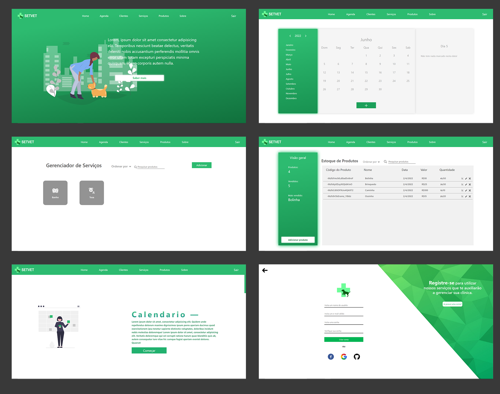

## SetVet

Se você quiser ver o projeto funcionando [clique aqui](https://caiofaraleski.github.io/SetVet/index.html).

## Sobre o projeto

Primeiramente este projeto foi criado para o meu TCC, do meu curso Técnico de Informática. 

O propósito dele é de auxiliar na gerência de clínicas veterinárias, onde você pode: gerenciar seus clientes, marcar qualquer tipo de compromisso, gerenciar seus serviços e por fim se sua clínica tiver um estoque você também pode gerencia-lo por aqui.

Esse foi o primeiro projeto "complexo" que fiz, e agora ele faz parte do meu portifólio, fique à vontade para fornecer qualquer feedback que possa contribuir com o projeto, código, estrutura ou algo que possa me tornar um desenvolvedor melhor!😉

Conecte-se comigo no [LinkedIn](https://www.linkedin.com/in/caio-faraleski/).

## Algumas observações

1 - A página de clientes está incompleta, então, eu deixei o link do header para a mesma quebrado.

## Funcionalidades

- Agenda
    - Marque suas consultas, compromissos entre outros.

- Clientes
    - Cadastre novos clientes e pets.
    - Gerencie as informacões dos clientes e pets, como dados do cliente, dados de consulta e etc.

- Serviços
    - Adicione e remova serviços que sua clínica dispõe.

- Estoque
    - Adicione e remova produtos do estoque.
    - Atualize a quantidade de cada produto em estoque.

- Sobre
    - Saiba mais sobre o que cada página do site faz.

- Registro
    - Cria uma conta para a sua clínica ou entre para usufruir dos serviços.

## Construído com 

- Html
- Css
- JavaScript
- Sass
- Bootstrap
- Firebase